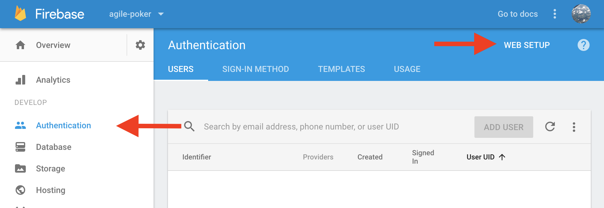
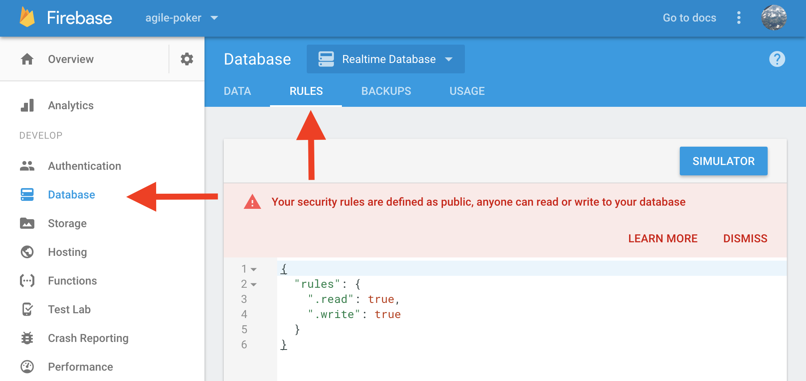
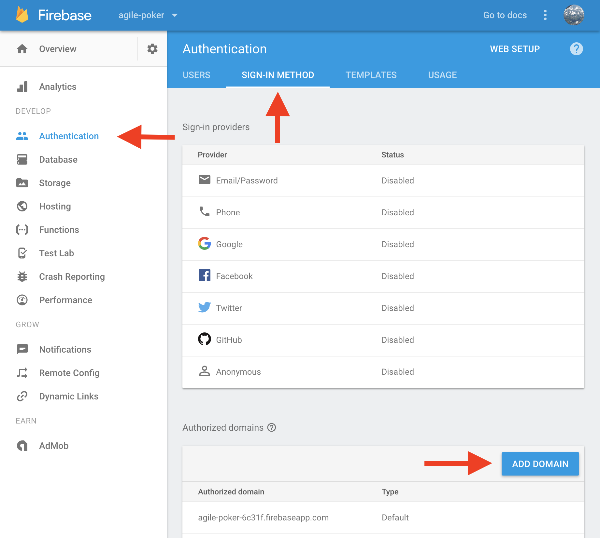

# Agile Poker

This tool was built to help our teams estimate their product backlogs. This was mostly built for fun/learning so I don't plan to document it extremely well, but it has been useful so I thought I would share it and show how to set it up so that others can use it for their backlog meetings as well.

### Tech
- [React](https://reactjs.org/) using [Create React App](https://github.com/facebookincubator/create-react-app)
- [yarn](https://yarnpkg.com/en/)
- [normalize.css](https://necolas.github.io/normalize.css/)
- [Firebase](https://firebase.google.com/)

### Setup
1. Clone this repo.
1. Create a [Firebase](https://firebase.google.com/) accout and add a project. (There is a free plan)
1. Replace the Firebase script tags in the [public/index.html](public/index.html) with the ones from your Firebase project. This can be found in the Firebase console under ***Authentication -> Web Setup*** as shown below. 
1. In the Firebase console under ***Database -> Rules***, update read and write to be `true` as shown below. 
1. Run `yarn install` and `yarn build` in the repo. This will create the `build` directory with all the assets needed. Then you can deploy it as a static website using a free hosting provider like [Netlify](https://www.netlify.com/).
    - After deploying, you may also want to add the domain to the Authorized Domains list in your Firebase console under ***Authentication -> Sign-in Method -> Add Domain*** as shown below. 